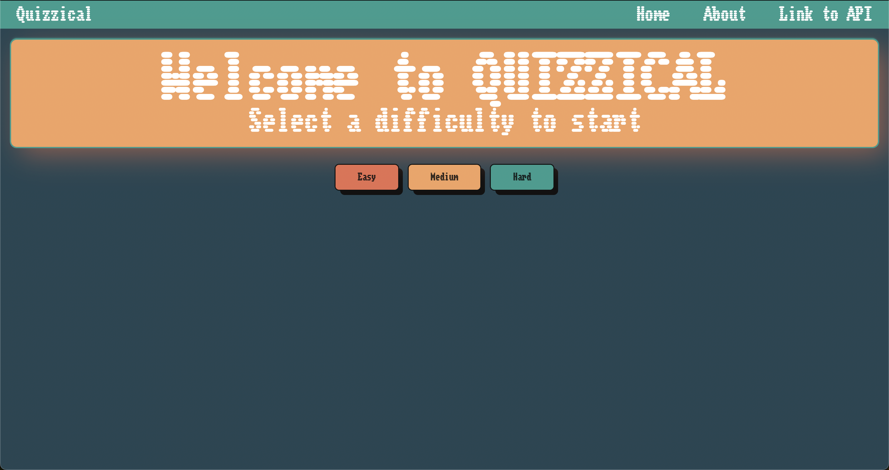

# Quizzical

## Team Members

- [Jacob Corletto]
  - email: jacob.corletto@csu.fullerton.edu
  - github: jacob-corletto
  - discord: jcorletto
- [Raxel Ortiz]
  - email: raxelortiz7@csu.fullerton.edu
  - github: marsxnow
  - discord: clickxnow
- [Esteban Zapata]
  - email: epzapata@csu.fullerton.edu
  - github: esteban-zapata
  - discord: estebomb.

## Description

Quizzical is a web application that allows users to play quizzes that are pulled
from the Open trivia database. Users can select from three categories of difficulty. The questions are multiple choice and the user can see their score at the end of the quiz. The question categories include music, film, gaming, computer knowledge, and many others.

## Tech Stack

- HTML
- CSS
- JavaScript
- Open Trivia Database API

We did not use boostrap for this project.

## How to run the application

Running the application is simple. First, clone the repository to your local machine. Then, navigate to the root directory of the project and run the following command: `open index.html`. This will open the application in your default web browser. **Important! Please make sure you have a stable internet connection before running the application as we are using an API to grab the questions.**

## How to use the application

Select one of the three difficuly buttons and take the quiz. The quiz will consist of 10 questions. After you have answered all the questions, you will be shown your score. You can then choose to play again or select a different difficulty.

## Question & Comments

Please let us know if you have any questions or comments. Please email one of the three team members listed above if the application does not work or if the **API is down**.
